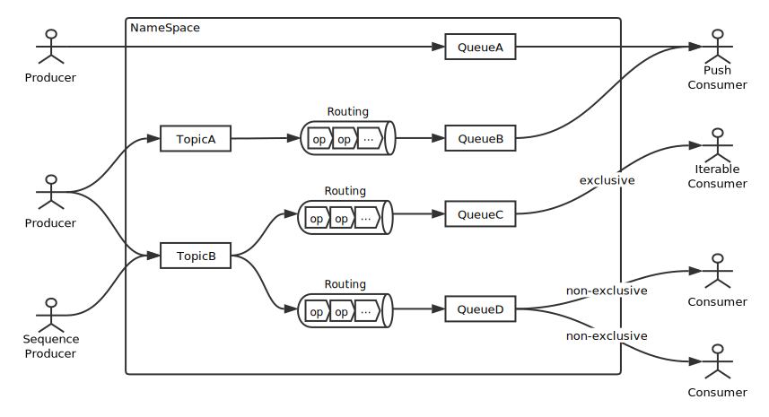

## Open-Messaging 
### A vendor-neutral open standard for distributed messaging and streaming, [JavaDoc](https://alibaba.github.io/openmessaging/).

Open-Messaging, whose charter includes the establishment of industry guidelines and messaging, streaming specifications to provide a common framework for finance, e-commerce, IoT and big-data area. The design principles are the cloud-oriented, simplicity, flexibility, and language independent in distributed heterogeneous environments. Conformance to these specifications will make it possible to develop a heterogeneous messaging applications across all major platforms and operating systems.

## The domain architecture

## Sponsored by Alibaba Group
